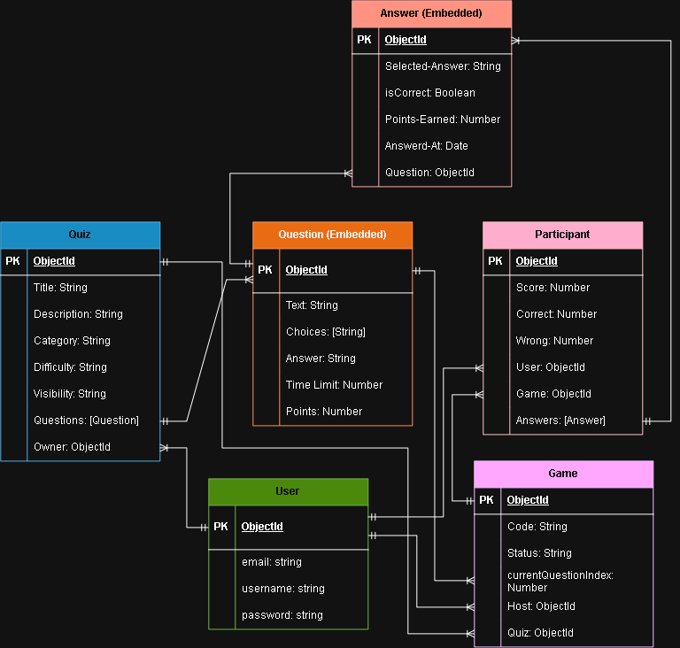

# Project Name

Quizly | Create Quizzes, Join Games, and Compete with Friends

## Overview

Quizly is a real-time multiplayer quiz platform. It allows users to create and manage quizzes, host live game sessions, and invite other players to join using a unique room code.

During a live game, players receive questions simultaneously, submit their answers, earn points, and compete on an automatically updated leaderboard. The application combines full CRUD functionality, JWT-based authentication, user authorization, RESTful APIs, and real-time communication to create an interactive quiz experience suitable for classrooms, training sessions, events, and friendly competitions.

## Technologies Used

- **Runtime Environemnt:** Node.js
- **Framework:** Express
- **Database:** MongoBD
- **Authentication:** JWT


## Backend Installation
 
Follow these steps to set up and run the React frontend locally.
 
### Prerequisites
 
- [Node.js](https://nodejs.org/) (v18 or higher recommended)
- npm (comes with Node.js)

### Steps
 
1. **Create a folder for your project and cd into it**
```bash
   mkdir quizly-backend
   cd quizly-backend
```
 
2. **Perform the following commands in the command line**
```bash
   git clone git@github.com:AmmarOsamaAli/quizly-backend.git
   rm -rf .git
   rm README.md
```
 
3. **Create a `.env` file with the following values**
```env
    MONGODB_URI=your-connection-string
    PORT=3000
    CLIENT_URL=http://localhost:5173
    JWT_SECRET=super-secret-key-no-one-would-guess
```
 
4. **run:**
```bash
   npm i
```
 
5. **run:**
```bash
   npm run dev
```
 
   The app should now be running at `http://localhost:3000`.
 
---

## Database Design




## Routes

#### User

| HTTP Method | Controller | Response |      URI     |    Use Case   |
|:-----------:|:----------:|:--------:|:------------:|:-------------:|
|     POST    |   SignUp   |    200   | auth/sign-up |  Sign Up User |
|     POST    |   SignIn   |    200   | auth/sign-in |  Sign In User |
|     GET     | verifyUser |    200   |    auth/me   | Verifies User |

#### Quiz 

| HTTP Method |  Controller  | Response |         URI         |         Use Case        |
|:-----------:|:------------:|:--------:|:-------------------:|:-----------------------:|
|     GET     | getAllQuizes |    200   |       /quizzes      | View All Public Quizzes |
|     GET     |  getQuizById |    200   |   /quizzes/:quizId  |    View Quiz Details    |
|     GET     | getMyQuizzes |    200   | /quizzes/my-quizzes | View Quizzes You Created|
|     POST    |  createQuiz  |    201   |       /quizzes      |       Create Quiz       |
|     PUT     |  updateQuiz  |    200   |   /quizzes/:quizId  |   Update Quiz Details   |
|    DELETE   |  deleteQuiz  |    204   |   /quizzes/:quizId  |       Delete Quiz       |

#### Questions

| HTTP Method |    Controller   | Response |                   URI                  |          Use Case          |
|:-----------:|:---------------:|:--------:|:--------------------------------------:|:--------------------------:|
|     GET     | getAllQuestions |    200   |       /quizzes/:quizId/questions       | View All Questions in Quiz |
|     GET     | getQuestionById |    200   | /quizzes/:quizId/questions/:questionId |    View Question Details   |
|     POST    |  createQuestion |    201   |       /quizzes/:quizId/questions       |     Create New Question    |
|     PUT     |  updateQuestion |    200   | /quizzes/:quizId/questions/:questionId |   Update Question Detials  |
|    DELETE   |  deleteQuestion |    204   | /quizzes/:quizId/questions/:questionId |       Delete Question      |

#### Game

| HTTP Method |   Controller   | Response |              URI             |            Use Case           |
|:-----------:|:--------------:|:--------:|:----------------------------:|:-----------------------------:|
|     POST    |   createGame   |    201   |    /quizzes/:quizId/games    | Host a Game and Generate Code |
|     POST    |    joinGame    |    201   |    /games/code/:code/join    |       Join Game by Code       |
|     GET     |   getGameById  |    200   |        /games/:gameId        |        View Game Detail       |
|    PATCH    |    startGame   |    200   |     /games/:gameId/start     |         Start the Game        |
|     POST    |  submitAnswer  |    200   |    /games/:gameId/answers    |   Submit Answer to Question   |
|    PATCH    |     endGame    |    200   |      /games/:gameId/end      |          End the Game         |
|    PATCH    |   cancelGame   |    200   |     /games/:gameId/cancel    |        Cancel the Game        |
|     GET     | getGameResults |    200   |    /games/:gameId/results    |     Retrieve Game Results     |


## Credits